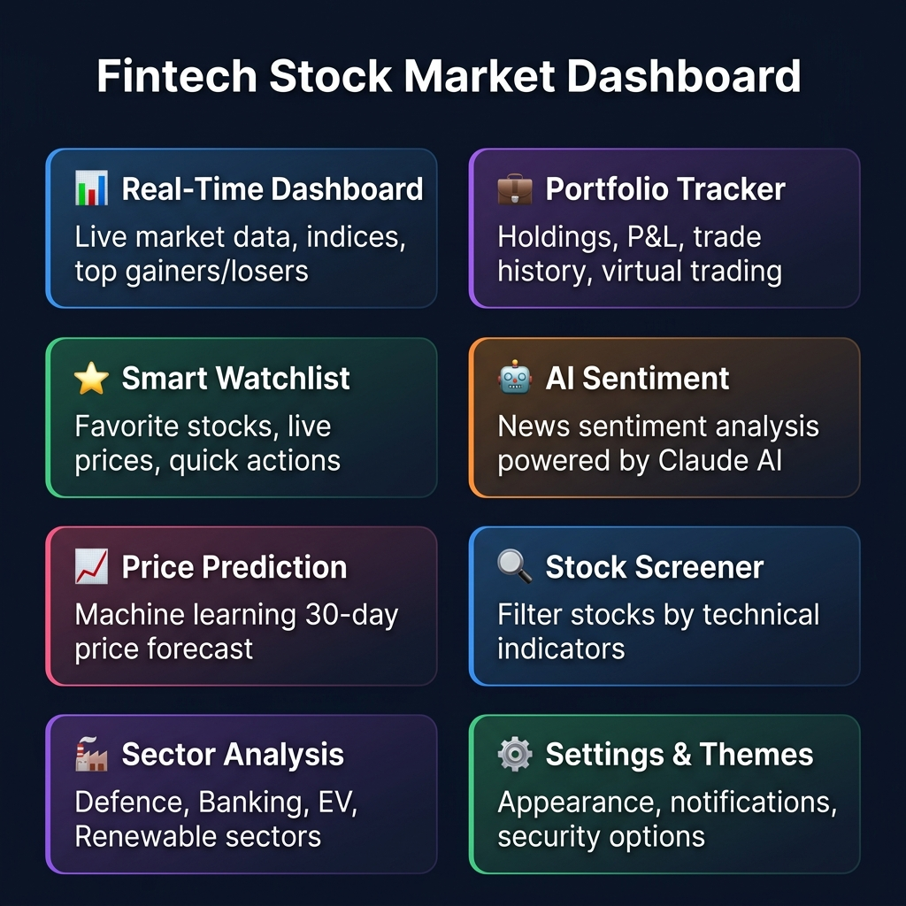
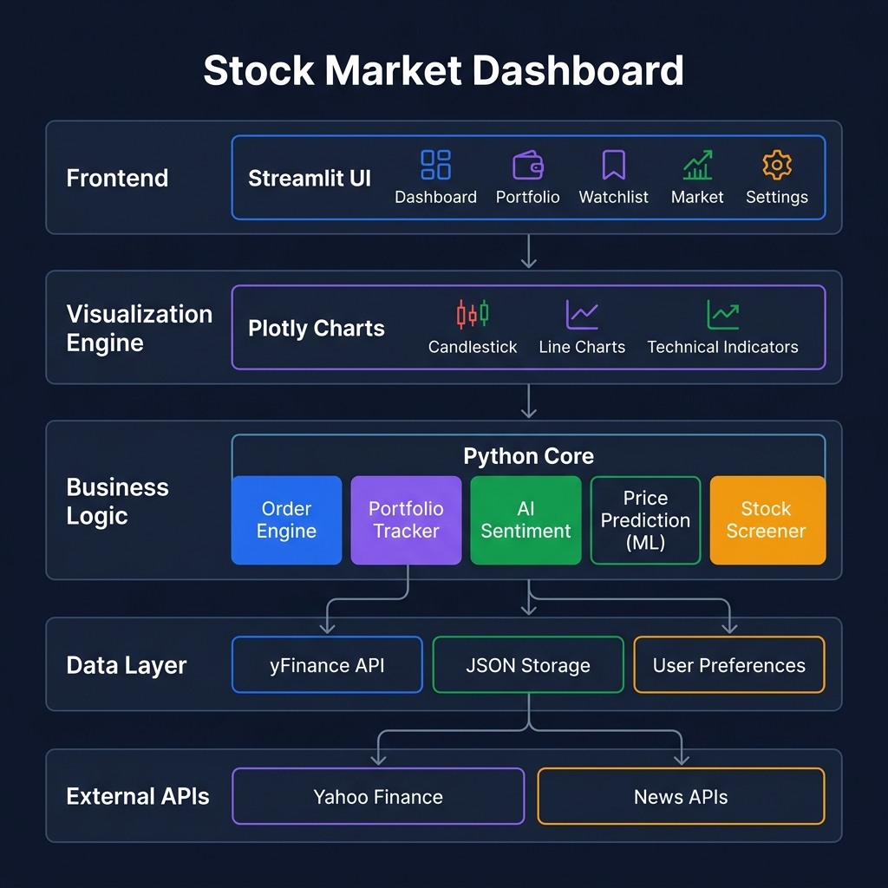
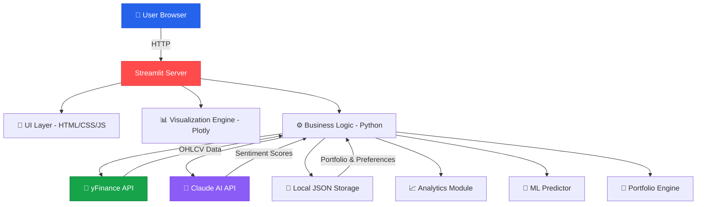
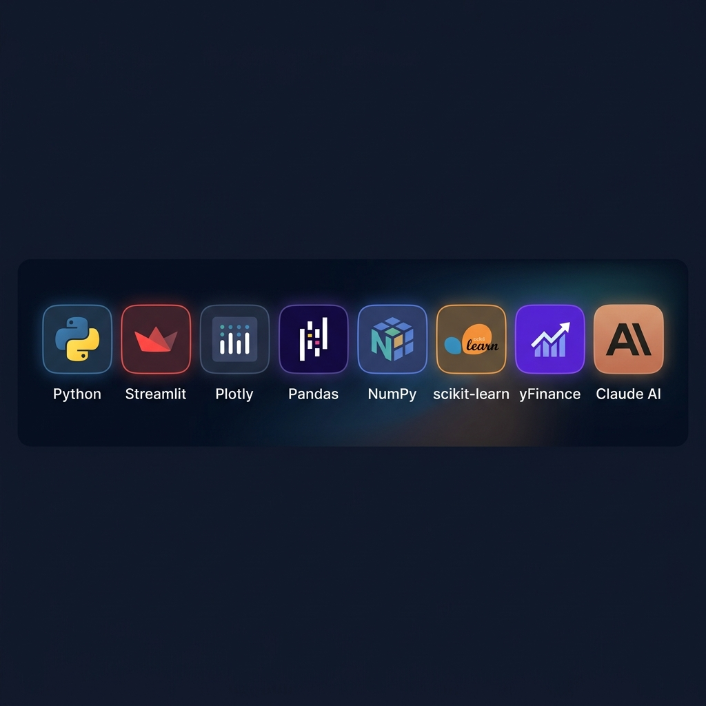

<div align="center">


# 💎 FintechHub — Stock Market Visualization Dashboard

### A Real-Time Stock Market Intelligence Platform

[](https://python.org)
[](https://streamlit.io)
[](https://plotly.com)
[](LICENSE)
[]()

**An advanced, production-grade stock market dashboard built as an M.Sc. CS & IT capstone project.**  
Live market data · AI-powered sentiment · ML price prediction · Virtual portfolio trading · 15+ pages

[Getting Started](#-getting-started) · [Features](#-features) · [Architecture](#-architecture) · [Tech Stack](#-tech-stack) · [Project Structure](#-project-structure)

</div>

---

## 📸 Application Preview

<div align="center">

> *FintechHub delivers a premium, glassmorphic trading interface with real-time data, interactive charts, and AI-powered insights — all in your browser.*

</div>

### 🏠 Dashboard Overview
The home page displays live market indices (Nifty 50, Sensex, Bank Nifty), market breadth analytics, top gainers/losers, and a curated news feed — all refreshing every 60 seconds.

### 💼 Portfolio & Virtual Trading
Full-featured portfolio tracker with buy/sell order execution, real-time P&L calculation, trade history, and a ₹1 Crore virtual cash balance. All data persists locally via JSON.

### ⚙️ Settings & Personalisation
A premium settings panel with profile management, appearance themes, notification controls, security options, and AI preference tuning — designed with glassmorphic UI cards.

---

## ✨ Features

<div align="center">



</div>

### Core Modules

| Module | Description | Key Capabilities |
|--------|-------------|-----------------|
| **📊 Dashboard** | Real-time market overview | Live indices, top gainers/losers, market breadth, news feed, auto-refresh |
| **⭐ Watchlist** | Personalised stock watchlist | Add/remove stocks, live price tracking, quick-action buy/sell buttons |
| **💼 Portfolio** | Virtual trading engine | ₹1 Cr virtual cash, buy/sell execution, holdings, P&L, trade history |
| **📋 Orders** | Trade history management | Order log, executed trades, status tracking, CSV export |
| **💰 Balance** | Fund management | Cash balance, deposits, withdrawals, transaction ledger |
| **📈 Market** | Live market intelligence | Index performance, sector heatmap, FII/DII data, market mood index |
| **📰 News** | Financial news aggregator | Real-time headlines from Yahoo Finance, AI sentiment tags |
| **📅 Calendar** | Market events calendar | Earnings dates, IPOs, economic events, dividend schedules |
| **🔍 Screener** | Stock screening tool | Filter by RSI, MACD, volume, P/E ratio, and custom criteria |
| **🏭 Sectors** | Sector deep-dives | Defence, Banking, EV & Tech, Renewable Energy, Broking analysis |
| **⚙️ Settings** | App preferences | Theme, accent colour, font size, notifications, security, AI prefs |

### Technical Analysis Tools

- **RSI (14-period)** — Overbought / Oversold detection with signal zones
- **MACD** — Bullish / Bearish crossover with signal line and histogram
- **Bollinger Bands** — Bandwidth squeeze and expansion analysis
- **SMA (20 & 50)** — Short-term and medium-term moving averages
- **EMA (20)** — Exponential weighted trend following
- **Volume Analysis** — Colour-coded volume bars with trend correlation

### AI & Machine Learning

- **🤖 News Sentiment** — Claude AI-powered per-headline sentiment scoring (Bullish / Bearish / Neutral)
- **📈 Price Prediction** — 30-day forecast using Ridge Regression with lag features and rolling volatility
- **📊 Confidence Intervals** — 95% prediction band for risk assessment

### Premium UI Components

- **Command Palette** — `Ctrl+K` quick navigation across all pages
- **Floating Action Button** — Quick-access trade actions
- **Toast Notifications** — Real-time feedback for user actions
- **Profile Dropdown** — Avatar-based menu with quick links and logout
- **Breadcrumb Navigation** — Contextual page hierarchy
- **Glassmorphic Cards** — Premium frosted-glass design language throughout

---

## 🏗 Architecture

<div align="center">



</div>

### High-Level Data Flow



### Component Architecture

| Layer | Component | Responsibility |
|-------|-----------|---------------|
| **Presentation** | `main.py` | Streamlit UI, routing, CSS, HTML templates, JS interactions |
| **Visualization** | `utils/visualizations.py` | Plotly chart generation (candlestick, line, RSI, MACD, prediction) |
| **Analytics** | `utils/analytics.py` | Technical indicator calculations (RSI, MACD, Bollinger, SMA, EMA) |
| **Data** | `utils/data_fetcher.py` | Yahoo Finance data retrieval and company information |
| **ML** | `utils/ml_predictor.py` | Ridge Regression price prediction with feature engineering |
| **AI** | `utils/sentiment.py` | Claude API integration for news sentiment analysis |
| **Portfolio** | `utils/portfolio.py` | Portfolio persistence, P&L calculation, trade execution |
| **Storage** | `*.json` | Local file-based persistence (portfolio, holdings, preferences) |
| **Config** | `.streamlit/secrets.toml` | API keys and sensitive configuration |

---

## 🛠 Tech Stack

<div align="center">



</div>

| Category | Technologies |
|----------|-------------|
| **Language** | Python 3.10+ |
| **Framework** | Streamlit 1.45+ |
| **Data** | Pandas, NumPy, yFinance |
| **Visualization** | Plotly 5.x (dark theme customised) |
| **Machine Learning** | scikit-learn (Ridge Regression) |
| **AI / NLP** | Anthropic Claude API |
| **Networking** | Requests, pytz |
| **Storage** | JSON (file-based persistence) |
| **Styling** | Custom CSS3 (glassmorphism, gradients, animations) |
| **Interactivity** | Vanilla JavaScript (command palette, dropdown, FAB) |

---

## 📋 Prerequisites

Before running FintechHub, ensure you have the following installed and configured:

### System Requirements

| Requirement | Minimum | Recommended |
|-------------|---------|-------------|
| **Python** | 3.10 | 3.11+ |
| **RAM** | 2 GB | 4 GB |
| **Disk Space** | 200 MB | 500 MB |
| **Browser** | Chrome 90+ | Chrome 120+ / Edge 120+ |
| **Internet** | Required | Required (for live market data) |

### API Keys Required

| Service | Purpose | How to Get |
|---------|---------|-----------|
| **Anthropic Claude API** | AI-powered news sentiment analysis | [console.anthropic.com](https://console.anthropic.com) → Create API key |

> **Note:** Yahoo Finance data is accessed via the free `yfinance` library and does not require an API key.

### Software Dependencies

```
streamlit          — Web framework
yfinance           — Yahoo Finance market data
pandas             — Data manipulation
numpy              — Numerical computing
plotly             — Interactive charting
scikit-learn       — Machine learning
requests           — HTTP client
pytz               — Timezone handling
```

---

## 🚀 Getting Started

### 1. Clone the Repository

```bash
git clone https://github.com/Nitinrajgor07/stock-market-visualization.git
cd stock-market-visualization
```

### 2. Create a Virtual Environment

```bash
# Windows
python -m venv venv
venv\Scripts\activate

# macOS / Linux
python3 -m venv venv
source venv/bin/activate
```

### 3. Install Dependencies

```bash
pip install -r requirements.txt
```

### 4. Configure API Keys

Create a file at `.streamlit/secrets.toml` with your API key:

```toml
[api_keys]
ANTHROPIC_API_KEY = "sk-ant-your-key-here"
```

### 5. Run the Application

```bash
streamlit run main.py
```

The dashboard will open at **http://localhost:8501** in your default browser.

### 6. Quick Start (Windows)

Alternatively, double-click `START_APP.bat` to launch the app automatically.

### Default Login Credentials

| Field | Value |
|-------|-------|
| **Email** | `nitin@fintech.com` |
| **Password** | `Nitinrajgor#2308` |

---

## 📁 Project Structure

```
stock-market-visualization/
│
├── 📄 main.py                     # Primary application (15,000+ lines)
│                                   #   ├── Authentication & session management
│                                   #   ├── Custom CSS (glassmorphic theme)
│                                   #   ├── JavaScript (command palette, FAB, dropdowns)
│                                   #   ├── Sidebar navigation (12 pages)
│                                   #   ├── Dashboard home page
│                                   #   ├── Watchlist, Portfolio, Orders, Balance
│                                   #   ├── Market overview, News, Calendar
│                                   #   ├── Stock screener
│                                   #   ├── Sector deep-dives (5 sectors)
│                                   #   └── Settings (8 sub-panels)
│
├── 📂 utils/                       # Core utility modules
│   ├── 📄 data_fetcher.py          #   yFinance data retrieval & company info
│   ├── 📄 analytics.py             #   RSI, MACD, Bollinger, SMA/EMA calculations
│   ├── 📄 visualizations.py        #   Plotly chart generators (dark theme)
│   ├── 📄 ml_predictor.py          #   Ridge Regression price predictor
│   ├── 📄 sentiment.py             #   Claude AI news sentiment analysis
│   └── 📄 portfolio.py             #   Portfolio P&L tracker & persistence
│
├── 📂 .streamlit/                  # Streamlit configuration
│   └── 📄 secrets.toml             #   API keys (Claude, etc.)
│
├── 📂 docs/                        # Documentation assets
│   └── 📂 images/                  #   README images & diagrams
│       ├── 🖼 hero_banner.png
│       ├── 🖼 architecture.png
│       ├── 🖼 features.png
│       └── 🖼 tech_stack.png
│
├── 📂 output/                      # Exported data
│   └── 📄 stock_data.csv           #   Historical OHLCV export
│
├── 📄 portfolio_data.json          # Persisted portfolio (holdings, orders, cash)
├── 📄 holdings.json                # Current stock holdings
├── 📄 user_preferences.json        # Theme, accent, font, density preferences
├── 📄 sync_holdings.py             # Holdings synchronisation utility
├── 📄 patches.py                   # Runtime monkey-patches
├── 📄 requirements.txt             # Python dependencies
├── 📄 START_APP.bat                # Windows one-click launcher
└── 📄 README.md                    # This file
```

---

## 📊 Module Details

### `utils/data_fetcher.py`
Fetches historical OHLCV data and company metadata via the `yfinance` library. Supports configurable date ranges and auto-caches results using Streamlit's `@st.cache_data` decorator.

### `utils/analytics.py`
Computes all technical indicators:
- **RSI** — 14-period Relative Strength Index
- **MACD** — Moving Average Convergence Divergence (12, 26, 9)
- **Bollinger Bands** — 20-day SMA ± 2σ
- **SMA / EMA** — 20 and 50-period moving averages

### `utils/visualizations.py`
Generates all Plotly charts with a consistent dark theme:
- Candlestick charts with volume overlay
- Line charts with SMA/EMA/Bollinger overlays
- RSI and MACD sub-charts
- Prediction forecast with confidence bands
- Multi-stock normalised comparison

### `utils/ml_predictor.py`
30-day price forecast using **Ridge Regression**:
- Feature engineering: 5 lag features + 10-day rolling volatility
- Train/test split with walk-forward validation
- 95% confidence interval band

### `utils/sentiment.py`
AI-powered sentiment analysis:
- Fetches latest news headlines from Yahoo Finance
- Sends each headline to **Anthropic Claude** for classification
- Returns per-headline sentiment: Bullish 🟢 / Bearish 🔴 / Neutral 🟡

### `utils/portfolio.py`
Virtual trading engine:
- ₹1 Crore starting balance
- Buy/sell stock execution with quantity validation
- Real-time P&L tracking (₹ and %)
- JSON-based persistence (survives app restarts)

---

## 🔒 Security

- Authentication-gated access (email + password)
- API keys stored in `.streamlit/secrets.toml` (not committed to Git)
- Session-based state management
- No external database — all data stays on your machine

---

## 🗺 Roadmap

- [ ] Dark mode theme toggle
- [ ] WebSocket-based real-time data streaming
- [ ] Multi-user authentication with hashed passwords
- [ ] Options chain analysis
- [ ] Advanced charting (Heikin-Ashi, Renko)
- [ ] Mobile-responsive layout optimisation
- [ ] Docker containerisation
- [ ] Unit test coverage

---

## 🤝 Contributing

Contributions are welcome! Please follow these steps:

1. **Fork** the repository
2. **Create** a feature branch (`git checkout -b feature/amazing-feature`)
3. **Commit** your changes (`git commit -m 'Add amazing feature'`)
4. **Push** to the branch (`git push origin feature/amazing-feature`)
5. **Open** a Pull Request

---

## 📄 License

This project is developed as part of an **M.Sc. CS & IT** capstone project.  
Distributed under the MIT License. See `LICENSE` for more information.

---

## 👨‍💻 Author

<div align="center">

**Nitin Rajgor**  
M.Sc. Computer Science & Information Technology

[](https://github.com/Nitinrajgor07)

</div>

---

<div align="center">

**⭐ If you found this project useful, please consider giving it a star!**

*Built with ❤️ using Python, Streamlit & Plotly*

</div>
