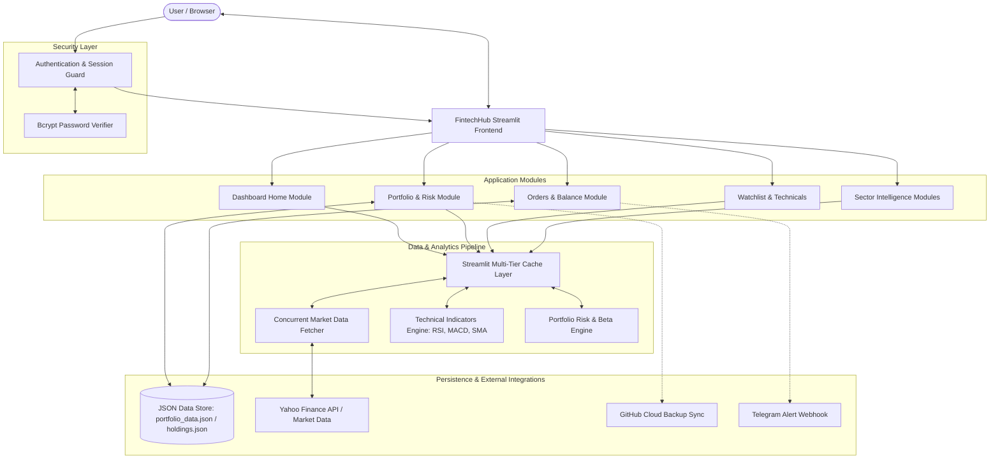

# FintechHub — Stock Market Visualization & Portfolio Intelligence Platform

> An interactive financial market dashboard for real-time portfolio monitoring, technical market analysis, virtual trading simulation, and investment insights.

[](https://python.org)
[](https://streamlit.io)
[](https://plotly.com)
[](LICENSE)
[]()

---

## 1. Project Overview

**FintechHub** is an end-to-end financial analytics and virtual trading application designed to provide retail investors and market enthusiasts with institutional-grade portfolio tracking, technical charting, and market intelligence.

Financial markets generate high-frequency data that is often fragmented across multiple portals. Retail investors frequently face challenges in tracking holistic portfolio returns, evaluating risk exposure, monitoring sector-specific trends, and testing trading strategies without risking real capital.

FintechHub resolves these challenges by integrating real-time market data feeds, interactive visualization tools, automated technical indicators, and persistent virtual portfolio tracking into a unified, responsive web interface.

### Target Audience & Use Cases
- **Retail Investors & Traders:** For tracking live market indices, sector momentum, and managing virtual investments with zero financial risk.
- **Academic & Portfolio Demonstrations:** Built as a comprehensive computer science and fintech capstone demonstration showcasing modular software design, concurrent data pipelines, and responsive data visualization.

---

## 2. Key Features

- 💎 **Bcrypt-Secured Authentication:** Protected dashboard access with salted bcrypt password hashing and session persistence.
- 📈 **Real-Time Market Tracking:** Live market indices (`Nifty 50`, `Bank Nifty`, `Sensex`), animated ticker tape, and trading session countdown with automatic 3:40 PM IST market-close detection.
- 💼 **Virtual Portfolio Engine:** Real-time tracking of overall and daily P&L, invested capital, current valuation, and LTCG/STCG holding periods.
- 📊 **Portfolio Allocation & Heatmaps:** Interactive Plotly donut charts for asset distribution and hierarchical Treemap heatmaps mapping position size against performance.
- 🤖 **AI Market Insights:** Automated portfolio diagnostic engine identifying top performers, allocation imbalances, and actionable daily trade insights.
- 🔥 **Trading Streak Tracker:** Consecutive profitable trading day streak calculation with automated win-rate analytics.
- ⭐ **Multi-Sector Watchlist:** Grouped watchlists with live sparklines, 52-week high/low range progress, and automated RSI/SMA technical signals.
- 📦 **Order Execution & Management:** Instant virtual BUY/SELL execution, automated position sizing calculator, GTT/target orders, and comprehensive transaction logs.
- 🏭 **Sector Deep-Dives:** Specialized intelligence pages covering Defence & Aerospace, Broking & Fintech, Renewable Energy, EV & Auto Tech, and Banking & NBFC.
- 🔄 **Cloud & Notification Sync:** Multi-channel data persistence supporting Telegram alert notifications and automated GitHub repository/Gist backup sync.

---

## 3. Dashboard Components

### 📊 Dashboard Home
- **Purpose:** Centralized operational overview answering *"What is the market and portfolio state right now?"* in seconds.
- **Displayed Information:** Live benchmark index chips, real-time scrolling ticker tape, market session countdown clock, day's P&L summary, top gainers/losers, and AI market sentiment.
- **Utility:** Delivers immediate market situational awareness without requiring navigation across individual modules.

### 💼 Portfolio Management & Allocation
- **Purpose:** Comprehensive monitoring of equity holdings, capital distribution, and tax-lot holding durations.
- **Displayed Information:** Holdings table with buy price, current price, total return (₹ / %), Day's P&L, holding term (Long Term vs Short Term), interactive asset allocation donut chart, and portfolio Treemap heatmap.
- **Utility:** Enables data-driven portfolio rebalancing and visual risk assessment across all active positions.

### 🛡️ Portfolio Risk & Beta Engine
- **Purpose:** Quantitative evaluation of overall portfolio volatility relative to broad market benchmarks.
- **Displayed Information:** Weighted portfolio Beta (β), risk exposure classification, and individual asset volatility metrics.
- **Utility:** Protects capital by highlighting over-leveraged or high-beta stock concentrations.

### 🤖 AI Insight & Trading Streak
- **Purpose:** Behavioral performance analytics and diagnostic feedback.
- **Displayed Information:** Daily trading streak milestone badges, win-rate percentage across closed trades, and automated portfolio health recommendations.
- **Utility:** Encourages disciplined risk management by quantifying trading consistency over time.

### ⭐ Watchlist & Technical Screen
- **Purpose:** Pre-trade scanning and multi-stock technical monitoring.
- **Displayed Information:** Sector-filtered watchlists, live quote changes, 14-period RSI status, 50-day moving average crossovers, and high-low range bars.
- **Utility:** Rapid identification of breakout and pullback opportunities across target equities.

### 📦 Virtual Order Terminal & GTT
- **Purpose:** Simulated trade execution with real-time price validation.
- **Displayed Information:** Live order book, position sizing capital calculator, executed transaction history, and pending Good-Till-Triggered (GTT) conditional orders.
- **Utility:** Allows users to test entry/exit sizing strategies against live price action.

### 💳 Virtual Balance Ledger
- **Purpose:** Financial accounting and liquidity tracking.
- **Displayed Information:** Available trading cash, margin utilized, realized vs unrealized gains, and transaction ledger.
- **Utility:** Maintains strict audit trails of all capital allocations and cash adjustments.

---

## 4. System Architecture



### Architecture Highlights
- **Multi-Tier Caching Pipeline:** Leverages `@st.cache_data` with fine-tuned TTLs and `ThreadPoolExecutor` parallelization to achieve sub-second tab transitions and eliminate redundant network calls.
- **State Isolation:** Session state separates ephemeral UI selections from underlying financial ledger records.
- **Fail-Safe Persistence:** Local atomic JSON reads/writes guarantee that portfolio balances and order histories remain consistent across browser sessions.

---

## 5. Technology Stack

| Layer | Technologies | Purpose |
|---|---|---|
| **Core Framework** | Python 3.10+, Streamlit | High-performance reactive web application framework |
| **Data Visualization** | Plotly Graph Objects, Plotly Subplots | Interactive financial candlestick charts, treemaps, and allocation donuts |
| **Market Data Ingestion** | `yfinance`, `requests` | High-frequency OHLCV historical prices, indices, and quotes |
| **Data Processing & ML** | `pandas`, `numpy`, `scikit-learn` | Technical analytics, moving averages, and statistical price predictions |
| **Security & Cryptography** | `bcrypt` | Salted credential verification and session authentication |
| **Styling & Presentation** | Vanilla CSS, Google Fonts (`Outfit`, `Inter`) | Modern, glassmorphic corporate fintech aesthetic |
| **Synchronization** | GitHub REST API, Telegram Bot API | Automated cloud database backups and live order alerts |

---

## 6. Project Directory Structure

```
stock-market-visualization/
│
├── 📄 main.py                     # Primary Streamlit application & routing engine
│                                   #   ├── Authentication & login interface
│                                   #   ├── Top navigation & ticker component
│                                   #   ├── Dashboard Home & Market overview
│                                   #   ├── Watchlist, Portfolio, Orders, Balance
│                                   #   ├── Sector deep-dives (Defence, IT, Banking, etc.)
│                                   #   └── Settings & cloud synchronization
│
├── 📂 utils/                       # Core modular utility packages
│   ├── 📄 data_fetcher.py          #   Market data retrieval & company info
│   ├── 📄 analytics.py             #   RSI, MACD, Bollinger Bands, SMA/EMA calculations
│   ├── 📄 visualizations.py        #   Custom Plotly financial chart builders
│   ├── 📄 ml_predictor.py          #   Predictive trend modeling engine
│   ├── 📄 sentiment.py             #   Market news sentiment analysis
│   └── 📄 portfolio.py             #   Ledger calculations & portfolio persistence
│
├── 📂 .streamlit/                  # Streamlit runtime configuration
│   └── 📄 secrets.toml             #   Encrypted application credentials & API keys
│
├── 📂 docs/                        # Architecture diagrams & media assets
│
├── 📂 output/                      # Exported CSV reports and audit records
│
├── 📄 portfolio_data.json          # Persisted virtual portfolio transactions & balance
├── 📄 holdings.json                # Persisted holding quantities & average prices
├── 📄 user_preferences.json        # Application theme, layout, and density settings
├── 📄 sync_holdings.py             # Holdings reconciliation script
├── 📄 patches.py                   # Runtime environment compatibility patches
├── 📄 requirements.txt             # Python package dependencies
├── 📄 START_APP.bat                # Windows one-click batch launcher
└── 📄 README.md                    # Project documentation
```

---

## 7. Installation & Setup

### Prerequisites
- **Python:** Version 3.10 or higher installed on your system.
- **Git:** Installed and available in your command line path.

### Step 1: Clone the Repository
```bash
git clone https://github.com/Nitinrajgor07/stock-market-visualization.git
cd stock-market-visualization
```

### Step 2: Create & Activate Virtual Environment
```bash
# Windows
python -m venv venv
venv\Scriptsctivate

# macOS / Linux
python3 -m venv venv
source venv/bin/activate
```

### Step 3: Install Package Dependencies
```bash
pip install -r requirements.txt
```

### Step 4: Configure Application Secrets (Optional)
Create or configure `.streamlit/secrets.toml` to enable external sync integrations:
```toml
APP_PASSWORD_HASH = "$2b$12$..."   # Bcrypt hash for dashboard login
GITHUB_TOKEN = "ghp_..."           # Optional: GitHub backup sync
TELEGRAM_BOT_TOKEN = "..."         # Optional: Telegram order notifications
TELEGRAM_CHAT_ID = "..."           # Optional: Target Telegram Chat ID
```

### Step 5: Launch the Application
```bash
streamlit run main.py
```
The application will start and automatically open in your default browser at `http://localhost:8501`.

> **Windows Quick Launch:** You can also start the application by double-clicking `START_APP.bat`.

---

## 8. Security & Data Integrity

- **Password Security:** Credentials are verified using industry-standard bcrypt hashing; raw passwords are never stored.
- **Zero Real Capital Risk:** All executions occur strictly within a virtual paper trading sandbox.
- **Local Data Privacy:** Financial ledgers and preferences are stored locally on your machine with optional user-controlled cloud sync.

---

## 9. Author & Academic Context

**Nitin Rajgor**  
*M.Sc. Computer Science & Information Technology*  
GitHub: [@Nitinrajgor07](https://github.com/Nitinrajgor07)

---

## 10. License

This project is licensed under the **MIT License** — see the [LICENSE](LICENSE) file for complete details.
