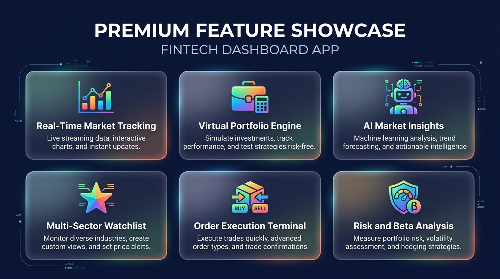
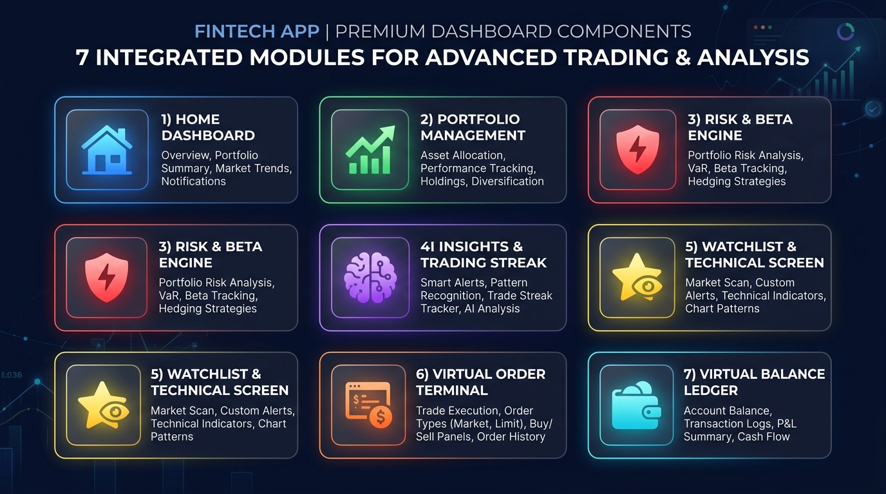
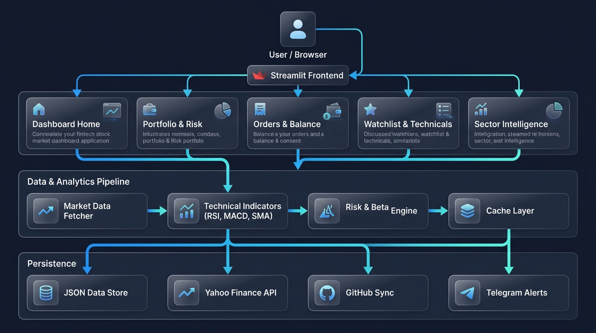
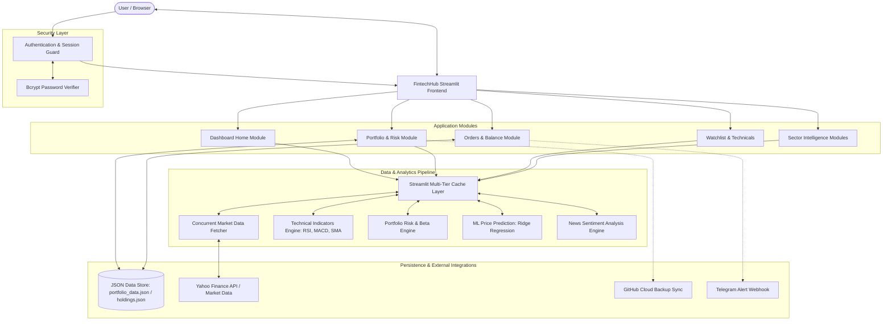
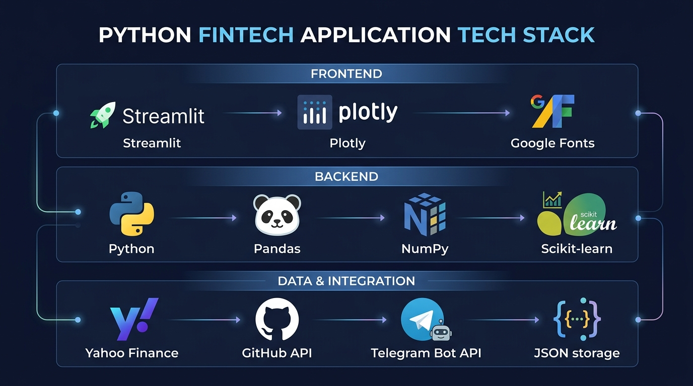
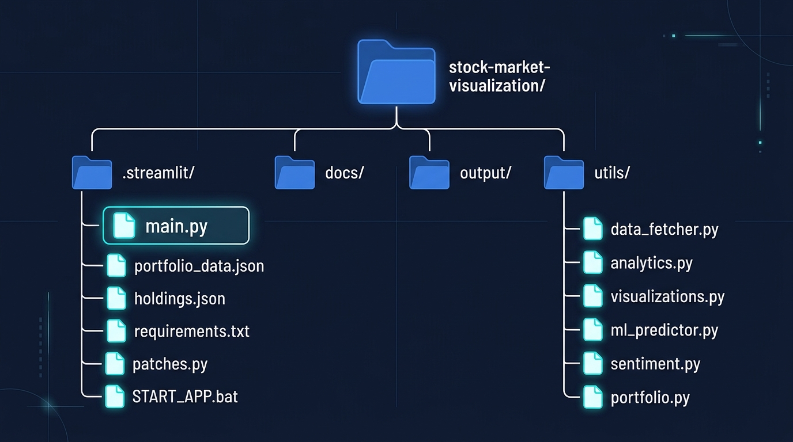
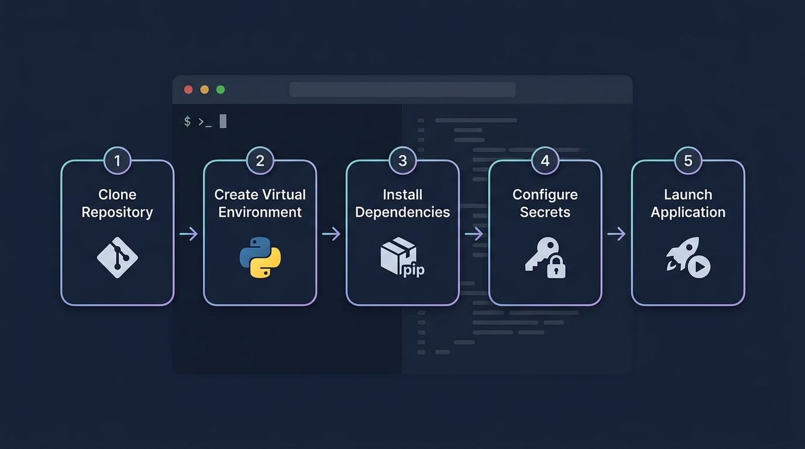

<div align="center">

# 💎 FintechHub

### Stock Market Visualization & Portfolio Intelligence Platform


<br/>

[](https://python.org)
[](https://streamlit.io)
[](https://plotly.com)
[](https://scikit-learn.org)
[](LICENSE)
[]()

<br/>

**An enterprise-grade, interactive financial market dashboard for real-time portfolio monitoring,<br/>technical market analysis, virtual trading simulation, and AI-powered investment insights.**

[Features](#-features) · [Architecture](#-system-architecture) · [Installation](#-installation--setup) · [Components](#-dashboard-components) · [Tech Stack](#-technology-stack)

</div>

<br/>

---

<br/>

## 📖 Table of Contents

1. [Project Overview](#-project-overview)
2. [Features](#-features)
3. [Dashboard Components](#-dashboard-components)
4. [System Architecture](#-system-architecture)
5. [Technology Stack](#-technology-stack)
6. [Project Directory Structure](#-project-directory-structure)
7. [Prerequisites](#-prerequisites)
8. [Installation & Setup](#-installation--setup)
9. [Configuration Reference](#-configuration-reference)
10. [Security & Data Integrity](#-security--data-integrity)
11. [Contributing](#-contributing)
12. [Author & Academic Context](#-author--academic-context)
13. [License](#-license)

<br/>

---

<br/>

## 🔎 Project Overview

**FintechHub** is an end-to-end financial analytics and virtual trading application designed to provide retail investors and market enthusiasts with institutional-grade portfolio tracking, technical charting, and market intelligence — all from a single, responsive web interface.

### The Problem

Financial markets generate high-frequency data that is often fragmented across multiple portals. Retail investors frequently face challenges in:

- **Tracking holistic portfolio returns** across multiple holdings and asset classes
- **Evaluating risk exposure** through quantitative beta and volatility metrics
- **Monitoring sector-specific trends** without subscribing to expensive terminals
- **Testing trading strategies** without risking real capital

### The Solution

FintechHub resolves these challenges by integrating **real-time market data feeds**, **interactive visualization tools**, **automated technical indicators**, and **persistent virtual portfolio tracking** into a unified, responsive web interface powered by Streamlit.

### Target Audience

| Audience | Use Case |
|---|---|
| **Retail Investors & Traders** | Track live market indices, sector momentum, and manage virtual investments with zero financial risk |
| **Finance Students & Researchers** | Explore quantitative technical indicators (RSI, MACD, Bollinger Bands) and ML-based price predictions |
| **Academic & Capstone Demonstrations** | Comprehensive computer science and fintech capstone showcasing modular software design, concurrent data pipelines, and responsive data visualization |

<br/>

---

<br/>

## ✨ Features

<div align="center">

</div>

<br/>

| # | Feature | Description |
|:---:|---|---|
| 🔐 | **Bcrypt-Secured Authentication** | Protected dashboard access with salted bcrypt password hashing and persistent session management |
| 📈 | **Real-Time Market Tracking** | Live market indices (`Nifty 50`, `Bank Nifty`, `Sensex`), animated ticker tape, and trading session countdown with automatic 3:40 PM IST market-close detection |
| 💼 | **Virtual Portfolio Engine** | Real-time tracking of overall and daily P&L, invested capital, current valuation, and LTCG/STCG holding periods |
| 📊 | **Portfolio Allocation & Heatmaps** | Interactive Plotly donut charts for asset distribution and hierarchical Treemap heatmaps mapping position size against performance |
| 🤖 | **AI Market Insights** | Automated portfolio diagnostic engine identifying top performers, allocation imbalances, and actionable daily trade insights |
| 🔥 | **Trading Streak Tracker** | Consecutive profitable trading day streak calculation with automated win-rate analytics |
| ⭐ | **Multi-Sector Watchlist** | Grouped watchlists with live sparklines, 52-week high/low range progress, and automated RSI/SMA technical signals |
| 📦 | **Order Execution & Management** | Instant virtual BUY/SELL execution, automated position sizing calculator, GTT/target orders, and comprehensive transaction logs |
| 🏭 | **Sector Deep-Dives** | Specialized intelligence pages covering Defence & Aerospace, Broking & Fintech, Renewable Energy, EV & Auto Tech, and Banking & NBFC |
| 🛡️ | **Risk & Beta Engine** | Quantitative portfolio volatility analysis with weighted beta calculations relative to broad market benchmarks |
| 📰 | **News Sentiment Analysis** | AI-powered (Claude API) and keyword-based news sentiment scoring with headline-level Bullish/Bearish/Neutral classification |
| 🔮 | **ML Price Predictions** | Ridge Regression with lag features and rolling volatility for forward-looking price forecasts with confidence intervals |
| 🔄 | **Cloud & Notification Sync** | Multi-channel data persistence supporting Telegram alert notifications and automated GitHub repository/Gist backup sync |

<br/>

---

<br/>

## 📊 Dashboard Components

<div align="center">

</div>

<br/>

### 🏠 Dashboard Home

| Attribute | Detail |
|---|---|
| **Purpose** | Centralized operational overview answering *"What is the market and portfolio state right now?"* in seconds |
| **Displays** | Live benchmark index chips, real-time scrolling ticker tape, market session countdown clock, day's P&L summary, top gainers/losers, AI market sentiment |
| **Utility** | Delivers immediate market situational awareness without requiring navigation across individual modules |

### 💼 Portfolio Management & Allocation

| Attribute | Detail |
|---|---|
| **Purpose** | Comprehensive monitoring of equity holdings, capital distribution, and tax-lot holding durations |
| **Displays** | Holdings table with buy price, current price, total return (₹ / %), Day's P&L, holding term (Long Term vs Short Term), interactive asset allocation donut chart, and portfolio Treemap heatmap |
| **Utility** | Enables data-driven portfolio rebalancing and visual risk assessment across all active positions |

### 🛡️ Portfolio Risk & Beta Engine

| Attribute | Detail |
|---|---|
| **Purpose** | Quantitative evaluation of overall portfolio volatility relative to broad market benchmarks |
| **Displays** | Weighted portfolio Beta (β), risk exposure classification, and individual asset volatility metrics |
| **Utility** | Protects capital by highlighting over-leveraged or high-beta stock concentrations |

### 🤖 AI Insight & Trading Streak

| Attribute | Detail |
|---|---|
| **Purpose** | Behavioral performance analytics and diagnostic feedback |
| **Displays** | Daily trading streak milestone badges, win-rate percentage across closed trades, and automated portfolio health recommendations |
| **Utility** | Encourages disciplined risk management by quantifying trading consistency over time |

### ⭐ Watchlist & Technical Screen

| Attribute | Detail |
|---|---|
| **Purpose** | Pre-trade scanning and multi-stock technical monitoring |
| **Displays** | Sector-filtered watchlists, live quote changes, 14-period RSI status, 50-day moving average crossovers, and high-low range bars |
| **Utility** | Rapid identification of breakout and pullback opportunities across target equities |

### 📦 Virtual Order Terminal & GTT

| Attribute | Detail |
|---|---|
| **Purpose** | Simulated trade execution with real-time price validation |
| **Displays** | Live order book, position sizing capital calculator, executed transaction history, and pending Good-Till-Triggered (GTT) conditional orders |
| **Utility** | Allows users to test entry/exit sizing strategies against live price action |

### 💳 Virtual Balance Ledger

| Attribute | Detail |
|---|---|
| **Purpose** | Financial accounting and liquidity tracking |
| **Displays** | Available trading cash, margin utilized, realized vs unrealized gains, and transaction ledger |
| **Utility** | Maintains strict audit trails of all capital allocations and cash adjustments |

<br/>

---

<br/>

## 🏗️ System Architecture

<div align="center">

</div>

<br/>

The following Mermaid diagram provides a detailed technical view of the system's data flow:



### Architecture Highlights

| Aspect | Implementation |
|---|---|
| **Multi-Tier Caching Pipeline** | Leverages `@st.cache_data` with fine-tuned TTLs and `ThreadPoolExecutor` parallelization to achieve sub-second tab transitions and eliminate redundant network calls |
| **State Isolation** | Session state separates ephemeral UI selections from underlying financial ledger records |
| **Fail-Safe Persistence** | Local atomic JSON reads/writes guarantee that portfolio balances and order histories remain consistent across browser sessions |
| **Market Holiday Awareness** | Integrated BSE/NSE market holiday calendar (2025–2026) with automatic detection via the `patches.py` module |
| **Graceful Degradation** | Sentiment analysis falls back from Claude API to keyword-based heuristics when API keys are unavailable |

<br/>

---

<br/>

## 🔧 Technology Stack

<div align="center">

</div>

<br/>

| Layer | Technologies | Purpose |
|---|---|---|
| **Core Framework** | Python 3.10+, Streamlit 1.45+ | High-performance reactive web application framework |
| **Data Visualization** | Plotly Graph Objects, Plotly Subplots | Interactive financial candlestick charts, treemaps, donut charts, RSI/MACD overlays |
| **Market Data Ingestion** | `yfinance`, `requests` | High-frequency OHLCV historical prices, company fundamentals, indices, and live quotes |
| **Data Processing** | `pandas`, `numpy` | Dataframe operations, moving averages, rolling statistics, and financial calculations |
| **Machine Learning** | `scikit-learn` (Ridge Regression, MinMaxScaler) | Predictive price forecasting with lag features, rolling volatility, and confidence intervals |
| **Security & Cryptography** | `bcrypt` | Salted credential verification and session authentication |
| **Styling & Presentation** | Vanilla CSS, Google Fonts (`Outfit`, `Inter`) | Modern, glassmorphic corporate fintech aesthetic |
| **Timezone Handling** | `pytz` | IST timezone-aware market session detection and countdown timers |
| **Synchronization** | GitHub REST API, Telegram Bot API | Automated cloud database backups and live order alerts |

<br/>

---

<br/>

## 📁 Project Directory Structure

<div align="center">

</div>

<br/>

```
stock-market-visualization/
│
├── 📄 main.py                        # Primary Streamlit application & routing engine (~16,000 lines)
│                                      #   ├── Authentication & login interface
│                                      #   ├── Top navigation & ticker component
│                                      #   ├── Dashboard Home & Market overview
│                                      #   ├── Watchlist, Portfolio, Orders, Balance
│                                      #   ├── Sector deep-dives (Defence, IT, Banking, etc.)
│                                      #   └── Settings & cloud synchronization
│
├── 📂 utils/                          # Core modular utility packages
│   ├── 📄 data_fetcher.py             #   Market data retrieval via yfinance (OHLCV, company info)
│   ├── 📄 analytics.py                #   Technical indicators: RSI(14), MACD, SMA/EMA, Bollinger Bands
│   ├── 📄 visualizations.py           #   Custom Plotly financial chart builders (candlestick, volume,
│   │                                  #   RSI, MACD, comparison, prediction charts)
│   ├── 📄 ml_predictor.py             #   Ridge Regression price prediction with confidence intervals
│   ├── 📄 sentiment.py                #   News headline sentiment analysis (Claude API + keyword fallback)
│   └── 📄 portfolio.py                #   Portfolio P&L calculations, allocation builder, history tracker
│
├── 📂 .streamlit/                     # Streamlit runtime configuration
│   └── 📄 secrets.toml                #   Encrypted application credentials & API keys
│
├── 📂 docs/                           # Documentation & media assets
│   └── 📂 images/                     #   Architecture diagrams, feature showcases, README images
│
├── 📂 output/                         # Exported CSV reports and audit records
│   └── 📄 stock_data.csv              #   Exported historical stock data
│
├── 📄 portfolio_data.json             # Persisted virtual portfolio transactions, balance & order history
├── 📄 holdings.json                   # Persisted holding quantities & average buy prices
├── 📄 user_preferences.json           # Application theme, layout density, notification & widget settings
├── 📄 sync_holdings.py                # Holdings reconciliation & export script for external sync
├── 📄 patches.py                      # Runtime environment patches (BSE/NSE holiday calendar, market hours)
├── 📄 requirements.txt                # Python package dependencies
├── 📄 START_APP.bat                   # Windows one-click batch launcher (auto-installs & runs)
└── 📄 README.md                       # Project documentation (this file)
```

### Module Responsibility Matrix

| Module | File | Responsibility | Key Functions |
|---|---|---|---|
| **Data Ingestion** | `utils/data_fetcher.py` | Fetches OHLCV data and company fundamentals from Yahoo Finance | `fetch_stock_data()`, `fetch_company_info()` |
| **Technical Analysis** | `utils/analytics.py` | Calculates RSI, MACD, SMA/EMA, Bollinger Bands, and statistical summaries | `add_indicators()`, `calculate_summary()` |
| **Visualization** | `utils/visualizations.py` | Builds interactive Plotly charts with dynamic theme support | `create_candlestick_chart()`, `create_rsi_chart()`, `create_macd_chart()` |
| **ML Predictions** | `utils/ml_predictor.py` | Ridge Regression forecasting with lag features and confidence bands | `predict_prices()` |
| **Sentiment** | `utils/sentiment.py` | News sentiment analysis via Claude API with keyword fallback | `analyse_sentiment()`, `fetch_news_headlines()` |
| **Portfolio** | `utils/portfolio.py` | Portfolio summary builder and historical value tracker | `build_portfolio_summary()`, `build_portfolio_history()` |
| **Market Patches** | `patches.py` | BSE/NSE holiday calendar and patched market-open detection | `is_market_open_patched()`, `is_holiday()` |
| **Holdings Sync** | `sync_holdings.py` | Exports holdings from portfolio data for external bot/API sync | `main()` |

<br/>

---

<br/>

## 📋 Prerequisites

Before installing FintechHub, ensure the following dependencies are available on your system:

### System Requirements

| Requirement | Minimum Version | Purpose |
|---|---|---|
| **Python** | 3.10+ | Core runtime environment |
| **pip** | 21.0+ | Python package installer |
| **Git** | 2.30+ | Repository cloning and version control |
| **Web Browser** | Chrome / Edge / Firefox (latest) | Application frontend |
| **Operating System** | Windows 10+, macOS 12+, or Ubuntu 20.04+ | Host environment |

### Python Package Dependencies

The following packages are automatically installed via `requirements.txt`:

| Package | Version | Purpose |
|---|---|---|
| `streamlit` | ≥ 1.45 | Web application framework and reactive UI engine |
| `yfinance` | ≥ 0.2 | Yahoo Finance API wrapper for market data retrieval |
| `pandas` | ≥ 2.0 | Dataframe operations and financial data manipulation |
| `numpy` | ≥ 1.24 | Numerical computing and array operations |
| `plotly` | ≥ 5.0 | Interactive charting library for financial visualizations |
| `scikit-learn` | ≥ 1.3 | Machine learning (Ridge Regression) for price predictions |
| `requests` | ≥ 2.31 | HTTP client for API integrations (Telegram, GitHub, Claude) |
| `pytz` | ≥ 2024.1 | Timezone-aware datetime operations (IST market hours) |
| `bcrypt` | ≥ 4.0 | Salted password hashing for authentication |

### Optional Dependencies

| Dependency | Purpose |
|---|---|
| **Anthropic API Key** | Enables AI-powered sentiment analysis via Claude (falls back to keyword-based heuristics without it) |
| **GitHub Personal Access Token** | Enables automated cloud backup sync of portfolio data |
| **Telegram Bot Token + Chat ID** | Enables real-time order notification alerts via Telegram |

<br/>

---

<br/>

## 🚀 Installation & Setup

<div align="center">

</div>

<br/>

### Step 1 — Clone the Repository

```bash
git clone https://github.com/Nitinrajgor07/stock-market-visualization.git
cd stock-market-visualization
```

### Step 2 — Create & Activate Virtual Environment

```bash
# Windows
python -m venv venv
venv\Scripts\activate

# macOS / Linux
python3 -m venv venv
source venv/bin/activate
```

### Step 3 — Install Package Dependencies

```bash
pip install -r requirements.txt
```

> **Note:** If `bcrypt` installation fails on Windows, install Microsoft Visual C++ Build Tools first, or run:
> ```bash
> pip install bcrypt --prefer-binary
> ```

### Step 4 — Configure Application Secrets

Create or configure `.streamlit/secrets.toml` to enable authentication and external integrations:

```toml
# ── Required ──────────────────────────────────────────
APP_PASSWORD_HASH = "$2b$12$..."     # Bcrypt hash for dashboard login

# ── Optional Integrations ─────────────────────────────
GITHUB_TOKEN = "ghp_..."             # GitHub backup sync
TELEGRAM_BOT_TOKEN = "..."           # Telegram order notifications
TELEGRAM_CHAT_ID = "..."             # Target Telegram Chat ID
ANTHROPIC_API_KEY = "sk-ant-..."     # Claude AI sentiment analysis
```

> **Generating a bcrypt hash:**
> ```python
> import bcrypt
> hash = bcrypt.hashpw("your_password".encode(), bcrypt.gensalt()).decode()
> print(hash)
> ```

### Step 5 — Launch the Application

```bash
streamlit run main.py
```

The application will start and automatically open in your default browser at `http://localhost:8501`.

> **🪟 Windows Quick Launch:** You can also start the application by double-clicking `START_APP.bat`, which automatically installs dependencies and launches the server.

<br/>

---

<br/>

## ⚙️ Configuration Reference

### Environment Variables & Secrets

| Variable | Location | Required | Description |
|---|---|---|---|
| `APP_PASSWORD_HASH` | `.streamlit/secrets.toml` | ✅ Yes | Bcrypt hash for dashboard authentication |
| `GITHUB_TOKEN` | `.streamlit/secrets.toml` | ❌ No | GitHub Personal Access Token for cloud backup |
| `TELEGRAM_BOT_TOKEN` | `.streamlit/secrets.toml` | ❌ No | Telegram Bot API token for order alerts |
| `TELEGRAM_CHAT_ID` | `.streamlit/secrets.toml` | ❌ No | Target Telegram chat/group ID |
| `ANTHROPIC_API_KEY` | `.streamlit/secrets.toml` | ❌ No | Anthropic Claude API key for AI sentiment |

### User Preferences (`user_preferences.json`)

Automatically generated on first use. Controls:

| Setting | Options | Default |
|---|---|---|
| Theme | Auto, Light, Dark | Light Theme |
| Accent Color | Blue, Purple, Green, Orange | Blue |
| Font Size | Small, Medium, Large | Medium |
| UI Density | Compact, Comfortable, Spacious | Comfortable |
| Landing Page | Home, Portfolio, Watchlist | Home |
| Chart View | Candlestick, Line | Candlestick |

<br/>

---

<br/>

## 🔒 Security & Data Integrity

| Aspect | Implementation |
|---|---|
| **Password Security** | Credentials are verified using industry-standard bcrypt hashing with salt; raw passwords are never stored or transmitted |
| **Zero Real Capital Risk** | All trade executions occur strictly within a virtual paper trading sandbox — no real financial transactions |
| **Local Data Privacy** | Financial ledgers and preferences are stored locally on your machine with optional user-controlled cloud sync |
| **Session Management** | Authentication state is managed via Streamlit session state with automatic expiration |
| **API Key Protection** | All API keys are stored in `.streamlit/secrets.toml` which is excluded from version control |

<br/>

---

<br/>

## 🤝 Contributing

Contributions are welcome! Please follow these steps:

1. **Fork** the repository
2. **Create** a feature branch (`git checkout -b feature/your-feature-name`)
3. **Commit** your changes (`git commit -m "feat: add your feature description"`)
4. **Push** to the branch (`git push origin feature/your-feature-name`)
5. **Open** a Pull Request

### Contribution Guidelines

- Follow Python [PEP 8](https://peps.python.org/pep-0008/) style conventions
- Add docstrings to all new functions and modules
- Test your changes locally with `streamlit run main.py` before submitting
- Keep commits atomic and well-described

<br/>

---

<br/>

## 👤 Author & Academic Context

<div align="center">

**Nitin Rajgor**
*M.Sc. Computer Science & Information Technology*

[](https://github.com/Nitinrajgor07)

</div>

<br/>

---

<br/>

## 📄 License

This project is licensed under the **MIT License** — see the [LICENSE](LICENSE) file for complete details.

<br/>

---

<div align="center">

**Built with ❤️ using Python & Streamlit**

<sub>© 2025–2026 FintechHub. All rights reserved.</sub>

</div>
